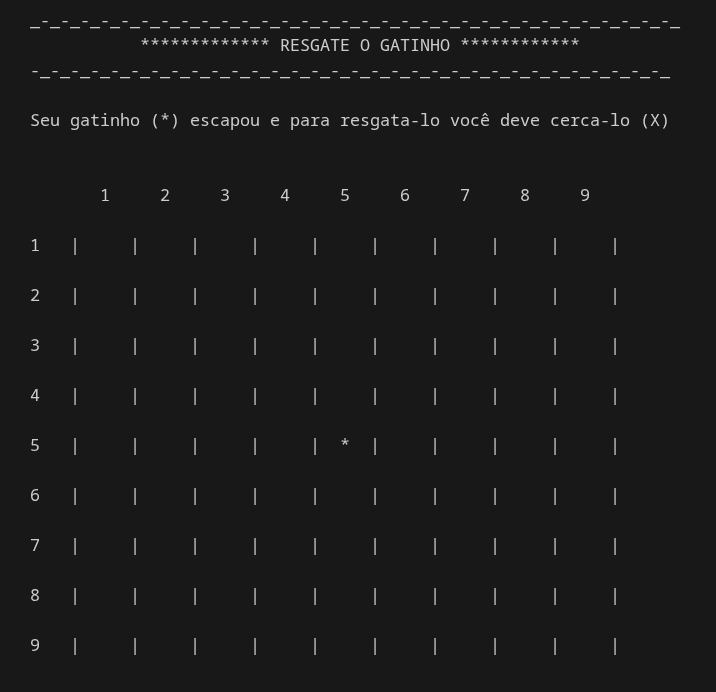

# Resgate_o_Gatinho
Seu gatinho (*) escapou e está com medo, você precisa resgata-lo bloqueando seu caminho (X)  

 
 

Esta é uma tentativa de melhorar o código da versão anterior a partir do meu ponto de estudo atual sobre C++.
Foi corrigido principalmente a movimentação do gatinho.
  
 

não aconselho usar um campo menor que 5 e, por motivo de tamanho, não consegui testar campos maior que 9;  

 

## Jogar Sem Baixar
1 - acesse: https://onlinegdb.com/eFyBfxytX   
2- mova o mouse até a barrinha cinza abaixo do código e quando o mouse mudar de forma, clique, segure e arrate a janela até o topo   
3 - clique em run

 

use CTRL C para parar o programa
